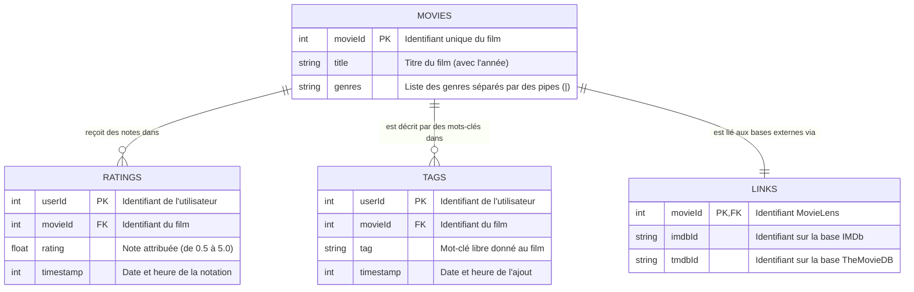

# Schéma relationnel du Dataset MovieLens (Small)

Ce document décrit les relations entre les différents fichiers `.csv` que nous venons de télécharger dans `data/raw/ml-latest-small/`.

Le dataset MovieLens est structuré autour d'une entité centrale : les **Films (Movies)**. Les autres fichiers viennent enrichir cette entité avec des notes (Ratings), des mots-clés (Tags) et des identifiants vers d'autres bases de données (Links).

## Diagramme Entité-Association (ER)

Voici la représentation visuelle de l'architecture des données :

## Description des fichiers

### 1. `movies.csv` (La table centrale)
C'est le fichier principal. Chaque ligne représente un film unique.
- **Clé Primaire :** `movieId`
- **Exemple de donnée :** `1, Toy Story (1995), Adventure|Animation|Children|Comedy|Fantasy`

### 2. `ratings.csv` (Les interactions Utilisateurs-Films)
Il contient toutes les notes données par les utilisateurs aux films. C'est ce fichier qui est crucial pour les algorithmes de **Collaborative Filtering** (recommandation basée sur le comportement des utilisateurs).
- **Clés Étrangères :** `movieId` (vers movies.csv)
- **Exemple de donnée :** `1, 1, 4.0, 964982703` (L'utilisateur 1 a donné la note de 4.0 au film 1)

### 3. `tags.csv` (Le contenu additionnel)
Il contient les mots-clés (tags) associés aux films par les utilisateurs. C'est très utile pour des algorithmes de **Content-Based Filtering** (recommandation basée sur le contenu/sujet du film).
- **Clés Étrangères :** `movieId` (vers movies.csv)
- **Exemple de donnée :** `2, 60756, funny, 1445714994` (L'utilisateur 2 a tagué le film 60756 comme "funny")

### 4. `links.csv` (Les ponts vers l'extérieur)
Il permet de faire le pont entre l'ID de MovieLens et d'autres APIs externes.
- Par exemple, si tu souhaites afficher l'affiche du film (Poster) dans une interface Web, tu pourras utiliser le `tmdbId` pour interroger l'API de TMDB (The Movie Database).

---

> [!TIP]
> **Prochaine étape (MLOps) :** Pour notre système de recommandation, l'étape logique suivante serait de charger ces CSV, de faire nos jointures (par exemple lier les notes aux titres), et de sauvegarder cette "matrice d'interaction" consolidée dans notre dossier `data/processed/` au format `.parquet` !
